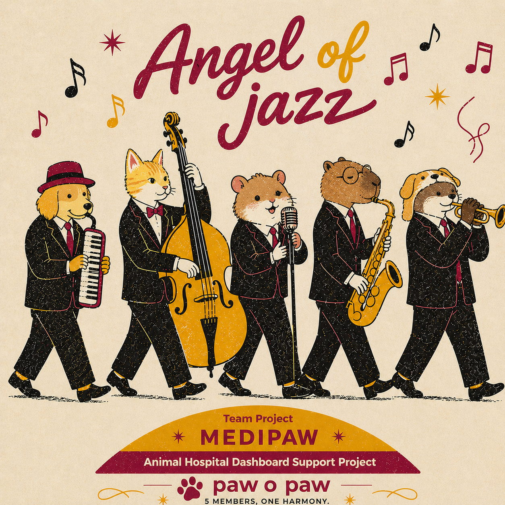
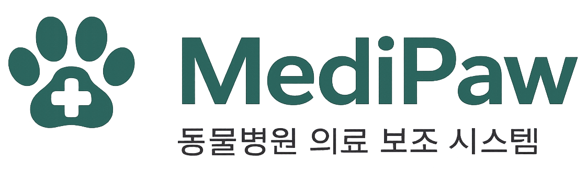
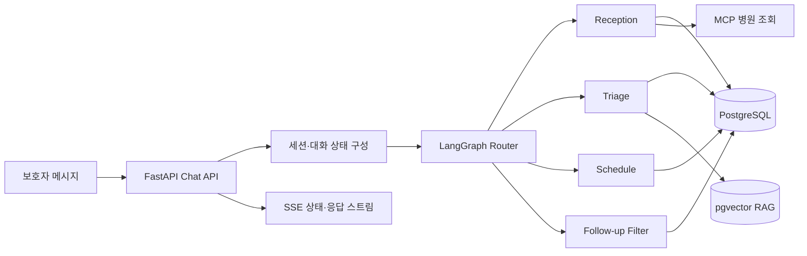

# MediPaw

<p align="center">
  
</p>

<p align="center"><strong>Team Angel of Jazz</strong></p>

<p align="center">
  
</p>

MediPaw는 보호자 상담과 동물병원 업무를 연결하는 반려동물 진료 지원 플랫폼입니다.

보호자는 반려동물을 등록하고 AI 문진을 거쳐 병원을 예약할 수 있습니다. 병원은 예약, 환자, EMR, 처방, 운영 일정을 관리하며, 운영자는 병원 입점과 서비스 상태를 관리합니다.

| 구분 | 내용 |
|---|---|
| 수행 프로젝트 | 다중 에이전트 협업 기반 업무 자동화 시스템 |
| 프로젝트명 | 소형 동물병원을 위한 LLM 멀티에이전트 기반 진료 워크플로우 통합 자동화 플랫폼 |

## 팀원 소개

| 이름 | 담당 영역 | 주요 역할 | 사용 기술 |
|---|---|---|---|
| 김지현 | Frontend | Frontend 개발, UI·UX 설계, 웹 서비스 배포 구성 | React, TypeScript, Vite, Tailwind CSS, Zustand, Axios, Nginx |
| 김찬영 | Full Stack · AI Agent · DevOps | AI Agent, Backend, Frontend, DB 연동, 서비스 통합, 인프라 및 배포 | Python, FastAPI, LangGraph, OpenAI API, RAG, pgvector, PostgreSQL, SQLAlchemy, Alembic, React, TypeScript, Docker, Nginx, AWS EC2·RDS·S3, Langfuse |
| 박지현 | Full Stack · UI·UX | Frontend 및 UI·UX, Backend API 개발, AI·DB 연동 | React, TypeScript, Vite, Tailwind CSS, Zustand, FastAPI, OpenAI API, PostgreSQL, Alembic |
| 조민서 | Backend · DB · Fine-tuning | Backend, DB 설계, API 개발, AI 모델 Fine-tuning 및 평가, Frontend API 연동 | Python, FastAPI, SQLAlchemy, Pydantic, Alembic, PostgreSQL, asyncpg, React API Integration, PyTorch, Docker |
| 이채림 | Backend · DB · AI Agent · Fine-tuning | Backend, DB 설계, AI Agent, RAG, AI 모델 Fine-tuning 및 평가, LLMOps | Python, FastAPI, LangGraph, OpenAI API, RAG, PostgreSQL, pgvector, SQLAlchemy, Alembic, Langfuse, React API Integration, PyTorch, Docker |

## 접속 주소

| 서비스 | 주소 | 로컬 테스트 계정 |
|---|---|---|
| 보호자 앱 | http://localhost:5173 | `guardian_test` / `Test1234!` |
| 수의사 앱 | http://localhost:5174 | `admin` / `Test1234!` |
| 회사·운영자 웹 | http://localhost:5175 | 운영자: `admin` / `Admin1234!` |
| API 문서 | http://localhost:8000/docs | - |
| MCP 서버 | http://localhost:8765/mcp | - |
| PostgreSQL | `localhost:5432` | DB: `medipaw` |


## 주요 기능

### 보호자 앱

- 회원가입, 로그인, 토큰 갱신, 로그아웃
- 아이디·비밀번호 찾기
- 보호자 프로필과 비밀번호 관리
- 반려동물 등록, 수정, 보관, 복원, 영구 삭제
- 병원 검색과 관심 병원·주 병원 설정
- AI 상담 세션 생성, 조회, 삭제
- 텍스트·사진·영상·음성 기반 상담
- 문진 결과를 이용한 예약 가능 시간 추천과 예약 확정
- 예약 목록 조회, 취소, 일정 변경
- 예약 후 상태 변화와 첨부 자료 전달
- 다국어 번역 지원

### 수의사 앱

- 병원 계정 로그인과 최초 비밀번호 변경
- 오늘의 예약·환자 현황 대시보드
- 예약 생성, 수정, 취소, 상태 변경
- 월간·주간·일간 예약 일정 관리
- 환자 검색과 진료 이력 조회
- 문진 결과, 리포트, 후속 경과 확인
- EMR 메모와 반려동물 정보 수정
- 약품 검색, 처방 생성·조회·삭제
- AI 처방 초안 생성
- 병원 프로필과 의료진 관리
- 병원·수의사 운영 시간과 휴진일 관리
- 알림 조회와 일괄 읽음 처리

### 회사·운영자 웹

- 서비스 소개와 보호자·수의사 데모
- 병원 입점 신청과 파일 업로드
- 입점 신청 승인·반려
- 병원, 의료진, 운영 시간, 활성 상태 관리
- 고객 문의 조회와 이메일 답변
- AI 검증 결과 조회 및 평가 실행

## AI 상담 흐름

보호자 메시지는 FastAPI에서 SSE 스트림으로 처리됩니다. 대화와 현재 상태를 불러온 뒤 LangGraph 오케스트레이터가 담당 에이전트를 선택합니다.



| 에이전트 | 역할 |
|---|---|
| Reception | 병원 정보, 운영 시간, 의료진, 일반 케어 문의 응대 |
| Triage | 증상 문진, 응급도 분류, 이미지·영상 분석, 문진 결과 생성 |
| Schedule | 문진 결과와 병원 운영 일정을 바탕으로 예약 슬롯 처리 |
| Follow-up Filter | 예약 후 상태 변화, 추가 자료, 예약 변경 요청 처리 |
| Prescription | 수의사 화면에서 진료 정보를 바탕으로 처방 초안 생성 |

라우터는 예약 전·후 상태와 현재 진행 중인 흐름을 제한 조건으로 사용합니다. 버튼 입력, 예약 확인, 첨부 파일처럼 명확한 입력은 규칙으로 처리하고, 나머지 자연어 발화는 모델 분류와 키워드 폴백을 사용합니다.

## 시스템 구성

```text
medipaw_final/
├── frontend/
│   ├── guardian-web/   # 보호자 React 앱
│   ├── vet-web/        # 수의사 React 앱
│   ├── company-web/    # 회사 소개·운영자 React 앱
│   └── shared/         # 공용 로고와 유틸리티
├── backend/
│   ├── app/
│   │   ├── api/        # FastAPI 라우터
│   │   ├── crud/       # 데이터 접근 계층
│   │   ├── models/     # SQLAlchemy 모델
│   │   ├── schemas/    # 요청·응답 스키마
│   │   ├── services/   # 오케스트레이터·번역 등 서비스
│   │   └── main.py     # API 진입점
│   ├── migrations/     # Alembic 마이그레이션
│   ├── scripts/        # 시드·평가·데이터 처리 도구
│   └── tests/          # 백엔드·AI 회귀 테스트
├── ai/
│   ├── agents/         # 상담·문진·예약·처방 에이전트
│   ├── orchestrator/   # LangGraph 라우터와 세션 상태
│   ├── services/       # 비전 모델과 영상 프레임 처리
│   └── docker/         # 개발 스택과 서비스 이미지
├── dev.sh
├── dev.ps1
└── docker-compose.prod.yml
```

### 기술 스택

| 영역 | 구성 |
|---|---|
| Frontend | React 18, TypeScript, Vite, React Router, Zustand, Tailwind CSS |
| Backend | Python 3.11, FastAPI, SQLAlchemy Async, Alembic |
| AI | OpenAI, LangChain, LangGraph, Langfuse OpenAI 계측 |
| Database | PostgreSQL 16, pgvector |
| Media | AWS S3, CloudFront, Pillow, OpenCV, 선택적 CNN 비전 모델 |
| Speech | Groq Whisper STT |
| Serving | Docker Compose, Nginx, Uvicorn |

세 프론트엔드는 Nginx에서 정적 파일로 제공됩니다. `/api` 요청은 FastAPI로 프록시되며, 상담 응답을 위해 프록시 버퍼링이 비활성화되어 있습니다.

## 환경변수

로컬 개발의 기본 설정 파일은 `backend/.env`입니다.

| 변수 | 용도 | 필수 여부 |
|---|---|---|
| `OPENAI_API_KEY` | AI 상담, 문진, 처방, 번역, RAG 임베딩 | AI 기능 사용 시 |
| `OPENAI_MODEL` | 공통 텍스트 모델 | 선택 |
| `OPENAI_VISION_MODEL` | 첨부 이미지 분석 모델 | 선택 |
| `USE_CNN_VISION` | 로컬 CNN 피부·안구 모델 사용 여부 | 선택 |
| `GROQ_API_KEY` | 음성 입력 STT | 음성 기능 사용 시 |
| `DATABASE_URL` | PostgreSQL 연결 주소 | Docker가 기본값 제공 |
| `SECRET_KEY` | JWT 서명 | 운영 환경 필수 |
| `AWS_ACCESS_KEY_ID` | S3 접근 키 | S3 사용 시 |
| `AWS_SECRET_ACCESS_KEY` | S3 비밀 키 | S3 사용 시 |
| `AWS_REGION` | S3 리전 | 선택 |
| `S3_BUCKET_NAME` | 업로드 버킷 | S3 사용 시 |
| `CLOUDFRONT_URL` | 업로드 파일 CDN 주소 | 선택 |
| `SMTP_USER` | 메일 서버 계정 | 이메일 발송 시 |
| `SMTP_PASSWORD` | 메일 서버 비밀번호 | 이메일 발송 시 |
| `SMTP_FROM` | 발신 주소 | 이메일 발송 시 |
| `CS_EMAIL` | 고객 문의 수신 주소 | 문의 알림 사용 시 |
| `ALLOWED_ORIGINS` | CORS 허용 출처 | 선택 |
| `DEBUG` | 상세 오류 응답 활성화 | 선택 |

API 키가 없어도 로컬 서버와 UI는 실행되지만 해당 외부 연동 기능은 사용할 수 없습니다.

## 팀 회고

### 김찬영

처음에는 AI를 활용한 바이브 코딩만으로도 큰 시스템을 만들 수 있을 것이라고 생각했습니다. 하지만 실제 프로젝트를 진행하면서 데이터베이스, 배포 환경, Git 협업, 테스트, 품질 검증 등 코드 작성 외에도 고려해야 할 요소가 많다는 것을 깨달았습니다. 특히 코드 리뷰는 생각보다 훨씬 어려웠지만, 그만큼 많은 것을 배울 수 있었던 과정이었습니다. 무엇보다 팀원들과 함께 시스템을 지속적으로 개선하며 중간 발표 때보다 훨씬 완성도 높은 결과물을 만들 수 있어 유종의 미를 거둔 것 같습니다.

### 박지현

프론트엔드를 중점적으로 맡으면서 비전공자로서 가장 깊이 공부할 수 있었던 프로젝트였습니다. 프론트엔드뿐만 아니라 백엔드, 데이터, 에이전트 등 시스템 전반의 코드를 직접 접하면서 각 파트가 어떻게 연결되는지 몸으로 익힐 수 있었습니다. 특히 수의사 화면을 담당하면서 “수의사라면 어떤 흐름이 가장 편할까?”를 계속 고민하다 보니, 기능 구현보다 사용자 입장에서 생각하는 것에 더 집중하게 됐습니다. 좋은 팀원들 덕분에 이상적인 협업으로 마무리할 수 있어서 감사했습니다.

### 이채림

실제로 에이전트 구현과 RAG 평가를 진행하면서, 에이전트의 핵심은 답변 생성보다 사용자의 상황을 이해하고 다음 행동으로 자연스럽게 연결하는 흐름 설계에 있다는 것을 느꼈습니다. 특히 멀티턴 대화에서 어떤 정보를 유지하고, 검색된 문서를 어떻게 답변에 반영할지 고민하는 과정이 가장 어려웠습니다. RAGAS 평가와 다양한 검색 조합 실험을 통해 에이전트의 성능을 감각이 아니라 지표로 확인할 수 있었고, 데이터 품질과 평가 설계가 AI 서비스의 신뢰도에 얼마나 중요한지도 배울 수 있었습니다.

### 조민서

백엔드와 DB, 에이전트 평가 등 여러 파트를 담당하면서, 코드 리뷰를 거치며 서버부터 데이터, 평가까지 각 레이어가 어떻게 연결되는지 조금씩 보이기 시작했습니다. 피드백을 받고 수정하는 과정에서도 단순히 오류를 고치는 것이 아니라, 어떤 방식으로 짜야 더 나은 결과를 낼 수 있을지 끊임없이 고민하게 됐고, 그 고민이 쌓이면서 처음보다 훨씬 나아진 코드를 작성할 수 있었습니다. 각자 맡은 파트에서 묵묵히 잘해 준 팀원들 덕분에 저도 제 역할에 집중할 수 있었고, 좋은 팀과 함께한 덕분에 혼자였다면 만들지 못했을 결과물을 완성할 수 있었습니다.
